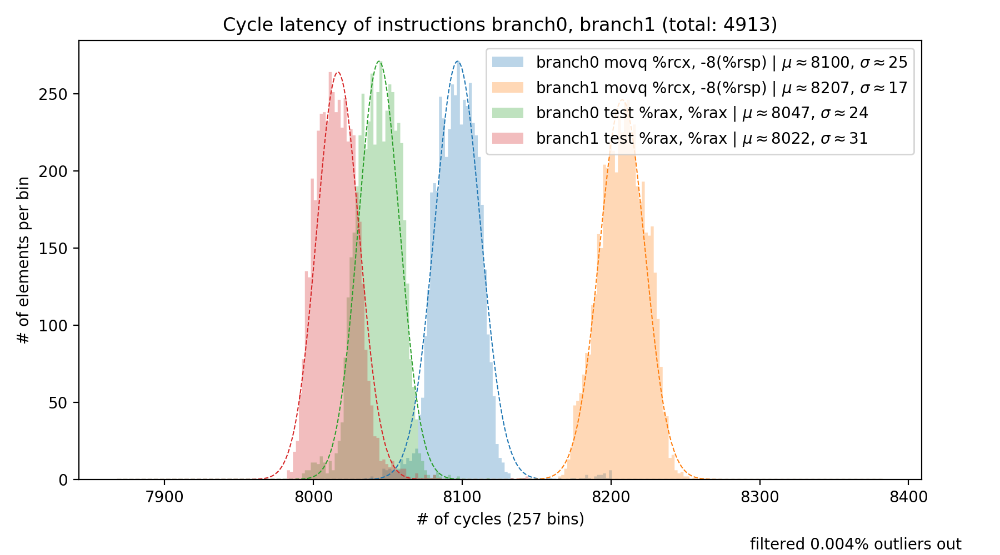
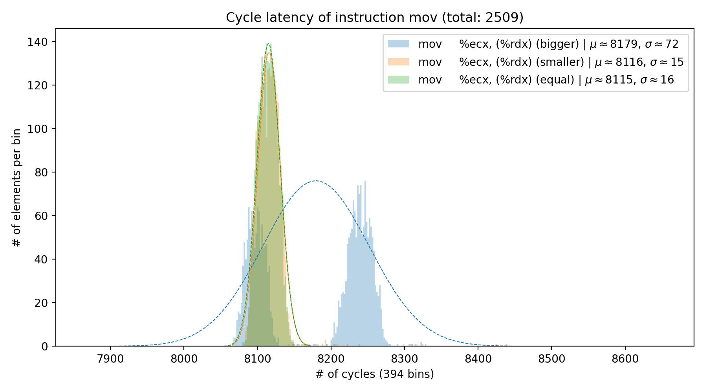

# Frontal Attack PoC

The paper containing the details of the Frontal attack can be found [here](https://arxiv.org/pdf/2005.11516.pdf).

## Abstract

We introduce a new timing side-channel attack on Intel CPU processors. Our _Frontal_ attack exploits timing differences that arise from how the CPU frontend fetches and processes instructions while being interrupted. In particular, we observe that in modern Intel CPUs, some instructions' execution times will depend on which operations precede and succeed them, and on their virtual addresses. Unlike previous attacks that could only profile branches if they contained different code or had known branch targets, the _Frontal_ attack allows the adversary to distinguish between instruction-wise identical branches. As the attack requires OS capabilities to set the interrupts, we use it to exploit SGX enclaves. Our attack further demonstrates that secret-dependent branches should not be used even alongside defenses to current controlled-channel attacks. We show that the adversary can use the _Frontal_ attack to extract a secret from an SGX enclave if that secret was used as a branching condition for two instruction-wise identical branches. We use the attack to leak information from two cryptographic libraries and show that it affects all Intel CPUs with SGX.

```
@misc{puddu2020frontal,
    title={Frontal Attack: Leaking Control-Flow in SGX via the CPU Frontend},
    author={Ivan Puddu and Moritz Schneider and Miro Haller and Srdjan Čapkun},
    year={2020},
    eprint={2005.11516},
    archivePrefix={arXiv},
    primaryClass={cs.CR}
}
```

## Setup

  - Please execute `git submodule update --init --recursive` after checking out the repository to fetch all the submodules

  - Follow the installation instructions in [sgx-step/README.md](https://github.com/dn0sar/sgx-step/blob/master/README.md) to install SGXStep.
  
    In short, to do that run the two scripts `install_SGX_driver.sh` and `install_SGX_SDK.sh`.
  Make sure to source the SGXSDK environment file after that.

  - The following boot kernel parameters must be specified:
    ```
    nox2apic iomem=relaxed no_timer_check isolcpus=1 nowatchdog nosmep nosmap
    ```

  - Make sure that the kernel module is loaded
    ```
    make load -C sgx-step/kernel
    ```
  - Install python-3.6
    - Ubuntu 18.04 has the correct version in python3
    - Ubuntu 16.04 needs an [additional ppa to install python3.6 ](https://askubuntu.com/questions/865554/how-do-i-install-python-3-6-using-apt-get) 
  - Install the python requirements.txt in the [frontal](frontal) directory
    ```
    pip3 install -r frontal/requirements.txt
    ```

### Stability Issues

The PoC might be unstable in your system, causing it to freeze to the point of needing to remove power in order to reboot it. This is most likely due to the user-space interrupt handler of SGX-Step causing a general protection fault in the kernel while single-stepping (if this applies to your system you should see `#GPF` errors on `dmesg` when trying to run the PoC). We have included a Ubuntu kernel patch to mitigate this issue and make single-stepping more stable. You can find the patch in the [kernel_patch](kernel_patch) directory. The patch should be applied on top of `Ubuntu-hwe-4.15.0-46.49_16.04.1`. To apply the patch to your system follow these steps (tested on Ubuntu 16 and 18):

- Clone the kernel source and apply the patch:
```
git clone git://kernel.ubuntu.com/ubuntu/ubuntu-xenial.git`

cd ubuntu-xenial

git checkout 595e176eed1fa6de3ac79ea9eacb7c82ac2853a3

git am ../kernel_patch/0001-Avoids-enabling-ints-if-it-might-jump-to-userspace.patch
```

- Now compile the kernel (note: this might take up to a couple of hours to execute on your machine.):

```
sudo apt-get build-dep linux linux-image-$(uname -r)

LANG=C fakeroot debian/rules clean`

LANG=C fakeroot debian/rules binary-headers binary-generic binary-perarch
```


This should produce several `.deb` packages on the top level directory from where the kernel was compiled.
Alternatively, we have provided the precompiled `.deb` packages on [kernel_patch/pre-built](kernel_patch/pre-built).

Now to install the packages execute the following command:

- `dpkg -i linux*fixandnotpr2*.deb`

Then restart your computer and select `Linux 4.15.0-46-generic` while booting. If the installation was successful `uname -a` should contain the following string:

- `4.15.0-46-generic #49~16.04.112+fixandnotpr2`


## Configuration

There are several parameters that can be tweaked in [frontal/Makefile.config](frontal/Makefile.config). The most important one is the `SGX_STEP_TIMER_INTERVAL` value that sets up the APIC counter for sgx-step. A suitable value will make sure that the script runs without errors. This value is platform specific see also [sgx-step/README.md](https://github.com/dn0sar/sgx-step/blob/master/README.md). Note that for the frontal attack we use the a APIC division of 1. Hence, as a rule of thumb the values for the stock SGX-Step need to be roughly doubled to work with our changes.

Troubleshooting:
  - The best way to get started is to try to run the [sgx-step/app/bench-improved](sgx-step/app/bench-improved) benchmark. Please set the `SGX_STEP_TIMER_INTERVAL` and `NUM` in [sgx-step/app/bench-improved/Makefile.config](sgx-step/app/bench-improved/Makefile.config) for this benchmark. We reccoment to start with a low `NUM` value and then try to increase it when a suitable value for `SGX_STEP_TIMER_INTERVAL` has been found. Too low values for `SGX_STEP_TIMER_INTERVAL` will incur in zero-stepping, which should give an error in the output of the execution. Too high values will skip instructioins. An appropriate value will produce an output containing the following line: `Detected 10000 of 10000 instructions`.
  - Once a correct value is found for [bench-improved](sgx-step/app/bench-improved), the same can be used on [frontal/Makefile.config](frontal/Makefile.config) to run the PoC. Depending on the machine the value obtained with the benchmark might need to be slightly adjusted to run with the PoC (+/-5 at most). Too high values will produce an error similar to the following: 
    ```
    [main.c] ERROR: Detected 10000 abnormal runs.. Try to tweak the SGX_STEP_TIMER_INTERVAL value. (Currently it's probably too high)
    ```
  - Too low values will either produce a `segmentation fault` or will cause the program to wait indefinately. Try first to re-load the kernel module and relaunching the app in these cases, and if the errors keep happening increase the value of `SGX_STEP_TIMER_INTERVAL`.

There are several other parameters that can be played with in [frontal/Makefile.config](frontal/Makefile.config). For instance, we added the possibility to also capture performance counters values alongside the timing information of each instruction. This can enabled by setting `PCM_ENABLED=1`. Details about the various parameters can be found at [frontal/README.md](frontal/README.md). The pre-set parameters should clearly show a high attack success probability.

**Important:** If you get a log with several of the following messages:
`[main.c] Caught fault 11! Restoring enclave page permissions.` Please make sure that CPU `CR4.UMIP` bit is unset. This is necessary for the code to run properly.

## Running the Attack

Follow these few steps to run the PoC for the Frontal attack. This PoC executes two identical branches containing only `mov` and `test` instructions after each other. A secret value decides which path is taken at each iteration. The attacker then sees a list of timings and based on those tries to detect which of the two identical branches is executed. The number of instructions in the branches can be configured as well as their initial alignments.

1. Make sure that the SGX-Step kernel module has been loaded since the last reboot (`make load -C sgx-step/kernel`)
2. Go to the frontal poc directory: `cd frontal`
3. Make sure that the variable `ATTACK_SCENARIO` in [Makefile.config](Makefile.config) is set to `MICROBENCH` to run this PoC.
4. The command `make plot` runs the tests, plots the results and calculates the attack success probability
    - Plots are saved in the plot folder. Note that if the peaks for the two branches are not overlapping the CPU is vulnerable
    - Two attack success probabilities are then printed. For example:
        ```
        Hit rate half:   97.13%
        Hit best:        99.02%
        ```
        Any hit rate above 55% percent indicates that the CPU is clearly vulnerable.

The `MICROBENCH` scenario is set up with two blanaced branches that contain many `test` and `mov` instructions. The alignment of the branches can be changes with the `ALIGN1` and `ALIGN2` variables in [Makefile.config](Makefile.config). 

A plot from a test run with the default parameters is given below, showing the timing distributions of the same instruction, but groupped with the branch at which they belong to.



## Running the attack on a mock of the IPP library v2.9

As described in our paper, the Frontal attack can exploit secret dependent branches that contain any write to memory. Even if these branches are perfectly identical, as long as the memory writes in them are aligned differently, modulo 16 in the virtual address space.
This is the case in the IPP Library in several instances. We choose one particular example for this PoC: the `l9_ippsCmp_BN` function, which is used to compare two big numbers.
The function has three secret dependent paths that are taken depending on whether the first number given to it is bigger, smaller, or equal to the second one.

The PoC creates a plot that shows the distribution of the single mov in each of these three paths. The plots show that the distribution of the same instruction (`mov %ecx, (%edx)`) present in the three paths. As long as these distributions do not overlap completely, the attack succeeds. Observe that we measure the same instruction, and yet the plot show different distributions for them depending on the branch in which they are.

There are two ways to make the code not exploitable.
1. Remove secret dependent branches (especially the ones that have a write to memory in them).
2. If a secret dependent branch with a write to memory must be present, the memory writes in them must be aligned the same way modulo 16 (see paper).

**Note1:** We run the library in our framework by copying the assembly code of the `l9_ippsCmp_BN` function rather than calling the library directly. The assembly code we use contains the same instructions and is aligned the same way as the original IPP library. Since the binaries are virtually identical, if the attack is possible with our mock version, it is possible also with the full library. It just requires more effort to adapt our framework to synchronize the attack with a full library.

**Note2:** As in SGX-Step, our framework also allows us to measure the number of instructions. We also report the detected number of instructions in our output. Each branch has a different number of instructions (196, 197, 198). This alone would also allow the attacker to exploit this function. But even if the number of instructions were the same, the frontal attack would still succeed.


Follow these few steps to run the PoC for the Frontal attack against a mock of the IPP library.

1. Make sure that the SGX-Step kernel module has been loaded since the last reboot (`make load -C sgx-step/kernel`)
2. Go to the frontal folder: `cd frontal`
3. Make sure that the variable `ATTACK_SCENARIO` in [frontal/Makefile.config](frontal/Makefile.config) is set to `IPP_LIB` to run this PoC.
4. The command `make plot` runs the tests and plots the results
    - Plots are saved in the plot folder. Note that if the peaks for the two branches are not overlapping the CPU is vulnerable
    - The script prints the average time it took to execute each path. Whenever these averages differ significantly the attacker can distinguish between them.
        ```
        Detected 5000 iterations

        Detected 196 instructions in the bigger path    (1305 occurrences)
        Detected 198 instructions in the smaller path   (1262 occurrences)
        Detected 197 instructions in the equal path     (1173 occurrences)

        Avg execution time of bigger path (1305 occurrences):   8114.308045977012
        Avg execution time of smaller path (1262 occurrences):  8183.963549920761
        Avg execution time of equal path (1173 occurrences):    8187.452685421995

        !!!! The attacker can use the frontal attack to exploit this run of the code.
        --------------------------------------------------------------------------------
        Start plotting
        --------------------------------------------------------------------------------
        - Start parsing log file
              - Parsed log for instruction "mov     %ecx, (%rdx) (bigger)"
              - Parsed log for instruction "mov     %ecx, (%rdx) (smaller)"
              - Parsed log for instruction "mov     %ecx, (%rdx) (equal)"
        - Finished parsing log file
        - Filtered -206 outliers (from 3519 data points) out
        - Use number of bins: 390
        - DONE, saved plot to file "plots/mov_different_branches_1173_plot.png"
        ```

A plot is produced in the path given in the last line of the output of the command. As said above, the plot depicts the distributions of the `mov %ecx, (%edx)` in the three different secret dependent paths. If these distributions are not overlapping, the IPP library is exploitable. Note that the output of `make plot` also reports whether the version is exploitable.

We use a two different code snippets to mock the `l9_ippsCmp_BN` function. The first is [frontal/Enclave/asm_ipp_mock_sync.S](frontal/Enclave/asm_ipp_mock_sync.S). It contains the original library code with instructions after it to simulate various attack capabilities. This test case is run when `INLINED_CALL` is set to `1` in  [frontal/Makefile.config](frontal/Makefile.config).
By setting the `INLINED_CALL = 0` the [frontal/Enclave/asm_ipp_mock.S](frontal/Enclave/asm_ipp_mock.S) assembly file is used instead for the attack. This file contains a mock of the `l9_ippsCmp_BN` without any instructions after it. We describe the exact differences between these two test cases below.

A plot from a sample run with `INLINED_CALL = 1` is given below. It plots the distributions of the same instruction (`mov` to memory), groupped by the path they belong to. The only difference between these instructions is their alignment. Note that each branch only contains 1 `mov` in it.


### **Clarifications about the INLINED_CALL parameter**
By running the exact copy of the new version of the IPP library (by setting `INLINED_CALL = 0`), you will notice that the current version does not seem vulnerable to the frontal attack. With `INLINED_CALL = 1`, we want to highlight a small change that makes it vulnerable again, by keeping the same alignment. In the test run with `INLINED_CALL=1`, we add several `movs` before the final return is performed. We do not change any of the branches themselves, only the instructions executed after them right before the return instruction.
With these additional `movs,` the branches are clearly distinguishable, despite the fact that the subsequent movs are not even interrupted (they are just present in the speculated instructions stream).
We think this scenarios is important in that it highlights that if the function is included inlined by another program, the security of the execution depends on whether the caller contains other movs after the function call.

## Notes on changes from the mainstream SGX-Step
If you have an app that worked with the SGX-Step library and want to integrate it with our changes (for instance, if you want to analyze the performance counters values), note that we slightly changed the libsgxstep interface to improve stability. The APIC counter is now automatically set in `aep_trampoline.S` with the value returned from the `aep_cb_fun` in your `main.c` file. Furthermore, we use a divisor of `1` instead of `2` (See [sgx-step/libsgxstep/apic.h](https://github.com/dn0sar/sgx-step/blob/master/libsgxstep/apic.h), and we made other changes to improve stability that require a bigger APIC counter value.

In short, if you had a working SGX-Step setup, you might need to roughly double your current `SGX_STEP_TIMER_INTERVAL` (and possibly increase it a bit more after that) to make it work with our changes, and have this value as `return` in your `aep_cb_fun` (instead of calling `apic_timer_irq( SGX_STEP_TIMER_INTERVAL )`).

Further details about the changes we made are given in the [sgx-step/README.md](https://github.com/dn0sar/sgx-step/blob/master/README.md) and in Miro Haller's [Bachelor thesis](https://github.com/Miro-H/sgx-accurate-time-msrmts).
